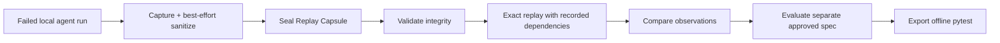

# TraceForge

TraceForge turns a failed Python agent run into immutable, offline replay evidence and a developer-approved regression test.

> **Status:** experimental local MVP. TraceForge is not production telemetry, production-grade security, or evidence of production adoption.

## Failure → regression test



Captured evidence stays immutable. Model and HTTP outcomes are replayed in sequence, request identities must match, and missing or unexpected fixtures fail closed without live fallback. Desired behaviour lives in a separate regression specification.

## Five-minute quick start

```bash
python -m venv .venv
source .venv/bin/activate
python -m pip install -e ".[dev,dashboard,langgraph]"
ruff format --check src tests
ruff check src tests
pytest
traceforge validate examples/weather/replay-capsule.json
traceforge replay examples/weather/replay-capsule.json \
  --runner traceforge.examples.weather_agent:run \
  --spec examples/weather/regression-spec.json
```

Run the complete offline capture demonstration:

```bash
python -m traceforge.examples.end_to_end
```

It captures a controlled failed LangGraph weather run, sanitizes and seals it, validates integrity, replays recorded model/geocoding/weather outcomes, evaluates umbrella expectations, exports pytest, and runs the generated test without external calls.

## CLI

```bash
traceforge seal draft.json --output capsule.json
traceforge validate capsule.json
traceforge replay capsule.json --runner package.module:function --spec regression.json
traceforge export-pytest capsule.json --runner package.module:function \
  --spec regression.json --output test_regression.py
traceforge serve --host 127.0.0.1 --port 8000
```

`MODULE:FUNCTION` is trusted local Python code and executes with the current process's authority. The dashboard never accepts arbitrary runner imports; it executes registered examples only.

## Local dashboard

Install `.[dashboard]`, run `traceforge serve`, and open <http://127.0.0.1:8000>. The dashboard validates capsules, shows dependency timelines and original/replay observations, evaluates assertions, and stores append-only replay summaries in local SQLite.

Screenshot placeholders:

- `docs/images/dashboard-empty.png` — capture at 1440×900 immediately after opening a fresh dashboard database.
- `docs/images/dashboard-replay.png` — upload `examples/weather/replay-capsule.json` and `regression-spec.json`, run `controlled-weather`, then capture at 1440×900.
- `docs/images/dashboard-mobile.png` — repeat the replay at a 390×844 responsive viewport.

No screenshots are fabricated in this repository.

## Weather demonstration

The controlled capsule records a model request for Kolkata, a geocoding response, and current-weather facts. Its original observation keeps incorrect “no umbrella” advice as evidence. Replay executes formatting and umbrella reasoning again, produces corrected advice, and passes a separate specification. Reserved `.invalid` URLs are identities only; no API key or network call is used.

## Security model and limitations

- Capture applies a versioned best-effort scanner before persistence, removing known credential keys, unsafe HTTP headers, and known secret query parameters.
- A passed scan records process completion, not a mathematical guarantee that a capsule is safe.
- Exact replay uses a process-wide Python socket guard, not an OS sandbox; unrelated concurrent network work is unsafe while it is active.
- Dashboard uploads are size-limited JSON and runners are allow-listed, but the dashboard has no authentication and should bind locally.
- Generated runners and CLI runner imports are trusted code.
- Review capsules before sharing or committing them. Never capture credentials or unreviewed production traces.

See [SECURITY.md](SECURITY.md) and the [Replay Capsule contract](docs/contracts/replay-capsule-v0.md).

## Extension map

- Authentication: FastAPI middleware, without changing replay domain code.
- Kafka: a future `EventPublisher`; it cannot mutate captured evidence.
- Frameworks: optional `FrameworkAdapter` plugins; only LangGraph is implemented now.
- Stronger scanning: future `RedactionScanner` implementations before sealing.
- Repair experiments: may read evidence and propose changes, never rewrite evidence; automatic fixing is not guaranteed.
- Distributed tracing and databases: future capture/storage adapters when measured need exists.
- Kubernetes and Terraform: deployment concerns only after local value and operational requirements are demonstrated.

## Docker

```bash
docker build -t traceforge-replay .
docker run --rm -p 8000:8000 traceforge-replay
```

The image runs as a non-root user and checks `/healthz`.

## Name notice

Unrelated projects already use the name “TraceForge.” This experimental project is not affiliated with them. The distribution is named `traceforge-replay`; the Python package, CLI, and project branding remain `traceforge`.

TraceForge does not guarantee automatic fixes, eliminate hallucinations, or provide benchmark or production reliability claims.
