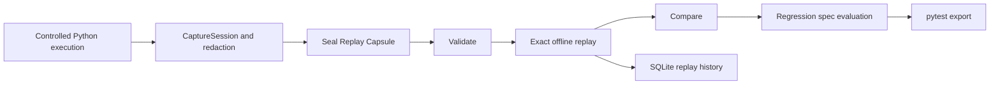
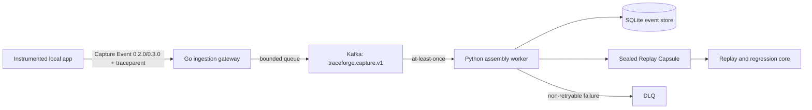

# TraceForge

**Don't just trace failures. Replay them.**

**Capture → Seal → Replay → Compare → Regress**

[](https://github.com/rit2001/traceforge/actions/workflows/ci.yml)
[](https://www.python.org/)
[](services/ingest-gateway)
[](LICENSE)
[](#project-status)

TraceForge is local-first replay and regression infrastructure for Python AI agents. It captures sanitized execution evidence, seals that evidence in an immutable Replay Capsule, replays recorded dependencies offline, compares behavior, and evaluates developer-approved regression expectations.

Version `0.4.1` is an **Experimental Beta**. It is not a hosted observability platform or a production-ready service.

## Why TraceForge?

Agent failures are difficult to reproduce when model responses, HTTP responses, and tool results change between runs. A trace can show what happened; reproducible evidence lets a developer run that behavior again.

TraceForge is designed around five boundaries:

- **Replay-first:** reproducible execution evidence takes priority over dashboard breadth.
- **Evidence is immutable:** sealing produces a content-addressed artifact; later expectations do not rewrite it.
- **Expectations are separate:** developer-authored regression specifications remain outside the Replay Capsule.
- **Exact replay fails closed:** missing, extra, reordered, or fingerprint-mismatched fixtures stop replay instead of falling back to a live dependency.
- **Completion is not correctness:** a replay can execute successfully and still fail its behavioral regression specification.

## What Works Today

| Status | Capability |
| --- | --- |
| **Implemented** | Replay Capsule `0.1.0`/`0.2.0` compatibility and `0.3.0` portable execution-span evidence, RFC 8785 canonicalization, SHA-256 integrity, structural/semantic validation, exact offline replay, recorded model/HTTP/tool playback, fail-closed matching, deterministic comparison, developer-authored regression specifications, pytest export, CLI, local FastAPI workbench, and SQLite replay history |
| **Implemented** | Three controlled cases: weather grounding, RAG citation grounding, and consequential HTTP/tool arguments |
| **Implemented** | Optional local Go ingestion gateway → Kafka → Python assembly worker → SQLite idempotency/assembly → sealed Replay Capsule path |
| **Implemented** | Bounded ingestion queue, event-ID deduplication, at-least-once processing, DLQ commit-safety boundary, W3C trace-context propagation, optional OpenTelemetry spans, and Prometheus metrics |
| **Implemented for local development** | Docker Compose, native Kustomize manifests for kind, and a narrow Terraform-managed local Kubernetes foundation |
| **Partial** | Capture is explicit and controlled; framework support is limited to Python and one bounded LangGraph adapter rather than arbitrary agents or tools |
| **Planned** | Generic tool dependency contracts, real-agent integration, fork replay, opt-in fresh-model execution, richer execution diffing, pipeline reliability work, and repeatable benchmarks |

## 60-Second Mental Model

```text
controlled Python execution
        │
        ▼
capture sanitized inputs, observations, and dependency outcomes
        │
        ▼
seal an immutable Replay Capsule
        │
        ▼
validate schema, semantics, request fingerprints, and integrity
        │
        ▼
exact offline replay with recorded model/HTTP/tool outcomes
        │
        ▼
compare observations and evaluate a separate regression spec
        │
        ▼
export executable offline pytest
```

The optional distributed path transports mutable capture events. It does not change the sealed Replay Capsule or exact-replay semantics.

## Quick Start

Clone the repository and install from source. Dependency installation requires network access once; the controlled replay path itself is offline.

```bash
python -m venv .venv
source .venv/bin/activate
python -m pip install -e ".[dev,dashboard,langgraph]"

traceforge --version
traceforge validate examples/weather/replay-capsule.json
traceforge replay examples/weather/replay-capsule.json \
  --runner traceforge.examples.weather_agent:run \
  --spec examples/weather/regression-spec.json
```

Run the controlled end-to-end demonstration:

```bash
python -m traceforge.examples.end_to_end
```

It captures a synthetic failed weather execution, seals and validates the capsule, replays recorded outcomes, evaluates a separate regression specification, exports pytest, and runs the generated regression offline.

## Replay Example

```bash
traceforge seal draft.json --output capsule.json
traceforge validate capsule.json
traceforge replay capsule.json \
  --runner package.module:function \
  --spec regression-spec.json
traceforge export-pytest capsule.json \
  --runner package.module:function \
  --spec regression-spec.json \
  --output test_regression.py
```

`MODULE:FUNCTION` runners are trusted local Python code. They execute with the current process's authority; they are not sandboxed.

## Replay Capsule

The [Replay Capsule `0.1.0` contract](docs/contracts/replay-capsule-v0.md), [`0.2.0` contract](docs/contracts/replay-capsule-v0.2.md), and [`0.3.0` contract](docs/contracts/replay-capsule-v0.3.md) define the immutable evidence boundary. A capsule contains sanitized inputs, execution observations, ordered recorded dependencies, provenance, and integrity metadata; 0.3 adds one portable structural tree and explicit dependency/event attribution. Capsule schema versions are independent from the TraceForge software release version, and published evidence contracts are not rewritten.

Canonical JSON and SHA-256 bind the capsule contents. Request fingerprints bind recorded dependency outcomes to sanitized request identity. Regression expectations and telemetry correlation remain separate from capsule integrity.

## Exact Replay

Exact replay is implemented for the tested dependency adapters. It freezes recorded model, HTTP, and generic tool outcomes, consumes them in one sequence, and blocks common socket-level network entry points during replay. It rejects:

- a request with a different fingerprint;
- missing recorded outcomes;
- reordered dependency calls; and
- recorded outcomes left unused at completion.

The network guard is process-wide protection against accidental live access, not an operating-system sandbox. Exact replay does not prove capture completeness or make arbitrary runner code safe.

Fork replay is **planned, not implemented** in `0.4.1`.

## Architecture

The replay core is local and does not require Kafka:



See [Architecture](docs/architecture.md), [Codebase map](docs/codebase-map.md), and the [accepted ADRs](docs/decisions/) for deeper boundaries and rationale.

## Distributed Capture Pipeline

An optional local path moves capture event ingestion away from the application process:



Kafka delivery is at least once. Domain idempotency is provided by event-ID deduplication in SQLite; TraceForge does **not** claim exactly-once Kafka processing. The current DLQ boundary commits the source offset only after the DLQ publish succeeds.

Use [Docker Compose](docs/operations/kafka.md) for the five-workload local stack. The [kind/Kustomize](docs/operations/kubernetes.md) and [Terraform](docs/operations/terraform.md) paths are bounded local-development foundations, not production or cloud deployment claims.

## OpenTelemetry and Metrics

The distributed path propagates W3C trace context through HTTP and Kafka headers. Optional OpenTelemetry instrumentation creates ingestion, assembly, sealing, and replay spans; replay starts a separate trace linked to the original capture context rather than pretending capture and replay are one continuous operation. These operational spans are distinct from sealed portable execution spans and never supply their IDs.

The Go gateway and Python worker expose bounded Prometheus metrics for local inspection. The repository does not include a production dashboard, alerting policy, SLO system, searchable trace store, or consumer-lag implementation.

## Regression Testing

Regression specifications are developer-authored and separate from captured evidence. They can assert final-output properties, tool-call arguments, and other supported deterministic observations. A completed replay can therefore still fail correctness evaluation.

TraceForge can explicitly promote developer-selected expectations from a technically completed,
caller-supplied `ReplayResult` into the existing `RegressionSpec 0.1.0`, then export a standalone
pytest regression from the sealed capsule, runner reference, and specification. The Python API
does not attest result provenance; Workbench performs exact replay again on the server before
building one coherent artifact bundle. Repaired behavior may differ from the historical failure;
deterministic equality is not the same as approved correctness. Promotion requires explicit
developer approval, never changes the Replay Capsule, and never infers or auto-accepts assertions. See
[Regression promotion and CI](docs/regression-promotion.md).

## Controlled Examples

| Example | Demonstrates |
| --- | --- |
| [`examples/weather`](examples/weather) | A recorded weather dependency and a grounding expectation for umbrella advice |
| [`examples/rag-citation`](examples/rag-citation) | A recorded retrieval result and citation-grounding expectation |
| [`examples/tool-argument-safety`](examples/tool-argument-safety) | Fail-closed request matching and approved consequential HTTP/tool arguments |

These examples use synthetic, controlled data. They do not establish real-world model quality or production reliability.

## Local Replay Workbench

```bash
traceforge serve --host 127.0.0.1 --port 18000
```

Open <http://127.0.0.1:18000>. The workbench is unauthenticated and must remain bound to localhost. It can inspect and replay the allow-listed controlled examples and trusted startup-registered runners.

## Repository Structure

```text
.github/                 CI and GitHub community files
deploy/                  Docker Compose, Kustomize, and kind assets
docs/                    Architecture, contracts, ADRs, operations, and state
examples/                Sanitized controlled replay cases
infra/terraform/         Narrow local Kubernetes foundation
schemas/                 Replay Capsule and Capture Event JSON Schemas
services/ingest-gateway/ Go HTTP ingestion gateway and Kafka producer
src/traceforge/          Python capture, replay, regression, CLI, web, and worker code
tests/                   Python unit and integration-oriented tests
```

Start with [docs/start-here.md](docs/start-here.md) and [docs/README.md](docs/README.md).

## Current Limitations

- Capture is not generic across arbitrary Python or LangGraph applications.
- Generic tool dependencies exist in Replay Capsule `0.2.0`, but no real LangGraph application has been integrated through them yet.
- Tool results requiring sanitization cannot become exact-replay evidence: the application still
  receives the original live result, but that `CaptureSession` fails closed at `finish()`.
- Fork replay and fresh/live model replay are not implemented.
- The socket guard is not an OS sandbox, and redaction is best effort.
- Storage is local SQLite/filesystem evidence, not a searchable distributed trace store.
- There is no hosted service, authentication, multi-tenancy, high availability, SLO/alerting system, or production Kubernetes/cloud Terraform.
- Kafka lag, DLQ inspection/redrive, broad rebalance/outage testing, and bounded shutdown draining remain roadmap work.
- No throughput, latency, reliability, or scale claims have been established by a repeatable benchmark suite.

## Roadmap

The public roadmap is evidence-gated:

- `v0.5.0` — prove sanitized capture in one real LangGraph agent application through a thin adapter while preserving framework-neutral core semantics;
- `v0.6.0` — implement fork replay and richer execution comparison;
- `v0.7.0` — harden the local event pipeline and its recovery operations; and
- `v0.8.0` — add a repeatable measurement and capacity-evidence harness.

See [docs/roadmap.md](docs/roadmap.md). No `v1.0` scope is defined.

## Design Principles

- Keep exact replay offline and fail closed.
- Preserve sealed evidence; attach expectations and correlations separately.
- Prefer explicit adapters and versioned contracts to implicit framework magic.
- Keep capture, capsule, dependency, replay, regression, and core diff semantics framework-agnostic; LangGraph is an adapter-side integration proof.
- Treat Kafka as at-least-once transport and enforce idempotency at the domain boundary.
- Make live model execution opt-in and visible if it is introduced later.
- Add distributed or cloud infrastructure only after measured need and an accepted design decision.

## Contributing

TraceForge welcomes focused bug fixes, documentation improvements, tests, and design discussion aligned with an approved roadmap milestone. Read [CONTRIBUTING.md](CONTRIBUTING.md), [PROJECT_MEMORY.md](PROJECT_MEMORY.md), and the relevant ADR before changing a durable boundary.

## Security

Never submit real API keys, production credentials, `.env` contents, private customer data, or unsanitized replay traces. Redaction is best effort; review every artifact before sharing or committing it. Report vulnerabilities privately as described in [SECURITY.md](SECURITY.md).

## Project Status

TraceForge `v0.4.1` is an **Experimental Beta** intended for local evaluation, controlled examples, and contributor development. It is not production-ready, enterprise-ready, or evidence of adoption, scale, model-quality improvement, or operational reliability.

Unrelated projects also use the name “TraceForge.” This project is not affiliated with them. The Python distribution is `traceforge-replay`; the package, CLI, and product name remain `traceforge` and TraceForge.

## License

Licensed under the [Apache License 2.0](LICENSE).
